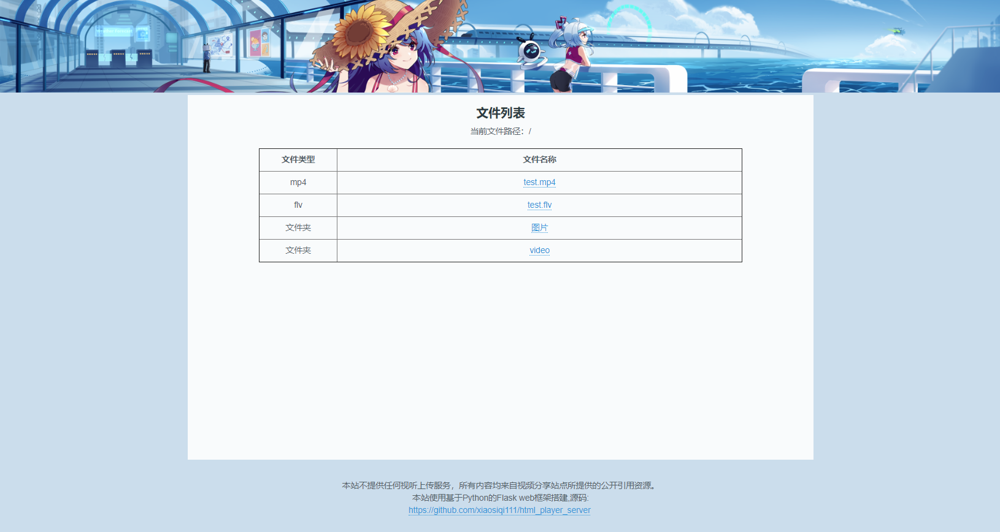

# 基于Flask和flv.js的HTML5视频播放器 - Simple Player


搭建家庭媒体服务器，让接入家庭网络的手机和电脑能通过网页在线观看服务器内的视频和图片内容。

目前可支持的视频格式：WEBM，MP4, OGG，FLV，MKV

网页使用响应式设计，同时适配手机和电脑端。

HTML5 播放器使用是flv.js。由 bilibili 网站开源。HTML5 原生仅支持播放 mp4/webm 格式，flv.js 实现了在 HTML5 上播放 FLV 格式视频。
[flv.js项目地址](https://github.com/bilibili/flv.js)

依赖：
- python3
- Flask

将图片文件和视频文件放到 static/file/ 里，然后运行服务器，用浏览器访问服务器即可观看视频和图片。
当然，也可以通过映射的方式，把文件夹映射到 static/file/ 里。
- Windows 平台的服务器可以通过`mklink`命令把存放视频文件的文件夹映射到static/file/目录里
- Linux 平台的服务器可以通过`ln`命令建立软连接把存放视频文件的文件夹映射到static/file/目录里


配置好python的运行环境后，执行：
```
python play.py
```

默认为127.0.0.1:8000，修改host和port需要参考[Flask](http://dormousehole.readthedocs.org/en/latest/)

移动端 AOSP 和 PC 端 chrome 观看视频运行良好。

运行效果截图：

